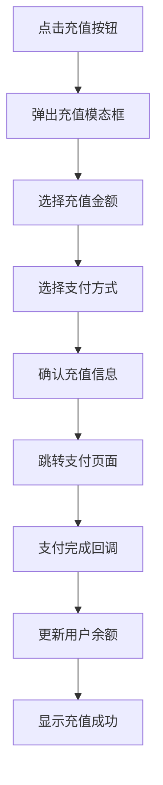

# 充值功能设计建议

## 🎯 功能概述

将原有的"获取量值"按钮改造为完整的充值入口，提供用户友好的充值体验。

## 💰 充值方案设计

### 1. 汇率设计
```
1元人民币 = 1000量值
```

### 2. 充值档位设计

| 金额 | 量值 | 推荐理由 | 特殊标识 |
|------|------|----------|----------|
| ¥10  | 10,000量值  | 新手试用 | - |
| ¥50  | 50,000量值  | 日常使用 | 🔥推荐 |
| ¥100 | 100,000量值 | 重度用户 | - |
| ¥500 | 500,000量值 | 企业用户 | 💎优惠 |

### 3. 支付方式支持

- **微信支付** - 主流移动支付
- **支付宝** - 广泛支持
- **银行卡** - 传统支付方式

## 🔧 技术实现建议

### 1. 前端交互流程



### 2. 后端API设计

#### 创建充值订单
```javascript
POST /api/recharge/create
{
  "amount": 50,           // 充值金额（元）
  "payment_method": "wechat", // 支付方式
  "user_id": "user_123"   // 用户ID
}

// 返回
{
  "order_id": "order_xxx",
  "payment_url": "https://pay.xxx",
  "qr_code": "data:image/png;base64,xxx"
}
```

#### 查询订单状态
```javascript
GET /api/recharge/status/{order_id}

// 返回
{
  "status": "paid",     // pending/paid/failed
  "amount": 50,
  "value_gained": 50000,
  "paid_at": "2025-01-06T10:30:00Z"
}
```

#### 充值记录查询
```javascript
GET /api/recharge/history?page=1&limit=10

// 返回
{
  "records": [
    {
      "order_id": "order_xxx",
      "amount": 50,
      "value_gained": 50000,
      "status": "paid",
      "created_at": "2025-01-06T10:30:00Z"
    }
  ],
  "total": 100
}
```

### 3. 安全考虑

- **订单签名验证** - 防止金额篡改
- **支付回调验证** - 确保支付结果真实性
- **重复提交防护** - 避免重复扣费
- **金额限制** - 单次/日充值限额

## 💡 用户体验优化

### 1. 视觉设计
- 使用渐变色突出充值按钮
- 添加充值成功的动画效果
- 清晰的价格展示和汇率说明

### 2. 交互优化
- 一键快速充值常用金额
- 支付方式智能推荐
- 充值进度实时反馈

### 3. 错误处理
- 网络异常重试机制
- 支付失败友好提示
- 订单超时自动取消

## 📊 数据统计建议

### 1. 充值转化漏斗
```
点击充值 → 选择金额 → 选择支付 → 完成支付
     ↓        ↓        ↓        ↓
   100%     80%      60%      45%
```

### 2. 关键指标监控
- **充值转化率** - 点击到完成的转化
- **平均充值金额** - 用户消费水平
- **支付成功率** - 支付通道质量
- **用户留存率** - 充值后的活跃度

## 🔄 后续功能扩展

### 1. 高级功能
- **充值优惠券** - 新用户首充优惠
- **充值返利** - 大额充值额外赠送
- **会员特权** - VIP用户充值折扣
- **分期充值** - 大额分期付款

### 2. 营销功能
- **充值活动** - 节假日充值促销
- **推荐奖励** - 邀请好友充值返佣
- **充值排行** - 充值榜单激励

## 🚀 实施计划

### 阶段一：基础功能（1-2周）
- [ ] 充值UI界面开发
- [ ] 基础支付接口集成
- [ ] 订单管理系统

### 阶段二：功能完善（2-3周）
- [ ] 多支付方式支持
- [ ] 充值记录查询
- [ ] 异常处理优化

### 阶段三：体验优化（1-2周）
- [ ] 动画效果完善
- [ ] 性能优化
- [ ] 数据统计接入

### 阶段四：高级功能（按需）
- [ ] 优惠券系统
- [ ] 会员特权
- [ ] 营销活动

---

**注意事项**：
1. 确保符合相关支付法规要求
2. 做好用户资金安全保护
3. 建立完善的客服支持体系
4. 定期进行安全审计